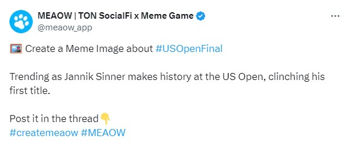

# MeaowImageChecker
Sample implementation for Image Checker for Meaow

## Features
- **Filtering images**: checking and scoring images

## Prerequisites

Before running the program, make sure you have completed the following steps:

### 1. Install the required dependencies by running the following command:

   ```shell
   pip install -r requirements.txt
   ```
### 2. Obtain an API key from OpenAI by signing up on their website.

### 3. Create a file named **.env** in the same directory as the program and add the following lines:
- `OPENAI_API_KEY`: Your OpenAI API key.
- `MODEL_ID`: OpenAI model name. Use **gpt-4o**
- `TWITTER_USERNAME`: X user name. (This is only necessary when you use scraper.py)

### 4. Add topic information, which you want to test, to **topics.json**.
The topic information should be taken from your target post of MEAOW account as below:
<br/>

- `id`: Sequential number
- `keyword`: Tag for Meme (e.g. USOpenFinal)
- `trending_reason`: Trending reason (e.g. Trending as Jannik Sinner makes history at the US Open, clinching his first title.)
- `post_id`: The target X post id (This is only necessary when you use scraper.py)
```json
    {
      "id": 14,
      "keyword": "USOpenFinal",
      "trending_reason": "Trending as Jannik Sinner makes history at the US Open, clinching his first title.",
      "post_id": 1833143331133534386
    }
```
Sample post: https://x.com/meaow_app/status/1833143331133534386
<br/>



<br/>

### 5. Prepare images to test in the following folder.
```shell
./images/<topic_keyword>/<image_file>
```

**topic_keyword** should be matched with the one in topics.json.
The image file should be a jpeg file.
 <br/>
e.g. 
```shell
./images/Toonami/Toonami_001.jpeg
```

<br/>

## Commands
To run this program, execute the following.
```shell
python main.py <topic_id> [image_filename]
```
e.g. <br/>
Topic: 8, File path: ./images/Toonami/Toonami_001.jpeg
```shell
python main.py 8 Toonami_001.jpeg
```
<br/>

When you specify only topic_id, all the images under the topic folder will be evaluated.
<br/>
e.g. <br/>
Topic: 8, Image file path: ./images/Toonami
```shell
python main.py 8
```

## Results
The evaluation result will be stored in the results folder with the evaluated date and topic name.
<br/>
e.g. <br/>
Date: 2024.09.11, Topic: 8
```shell
Result file: ./results/20240911_Toonami.json
```

The result content should be like this.
```json
[
  {
    "keyword": "Toonami",
    "trending_reason": "Trending as Toonami celebrates 25 years of iconic anime.",
    "score": 5,
    "reasoning": "The image features a well-known character from an iconic anime series that aired on Toonami. Given that Toonami is celebrating 25 years of iconic anime, this image is directly relevant to the trending theme. The character's recognition and association with Toonami make it an excellent match for the current keyword and reason for trending.",
    "image_path": "images\\Toonami\\Toonami_001.jpeg"
  }
]
```


